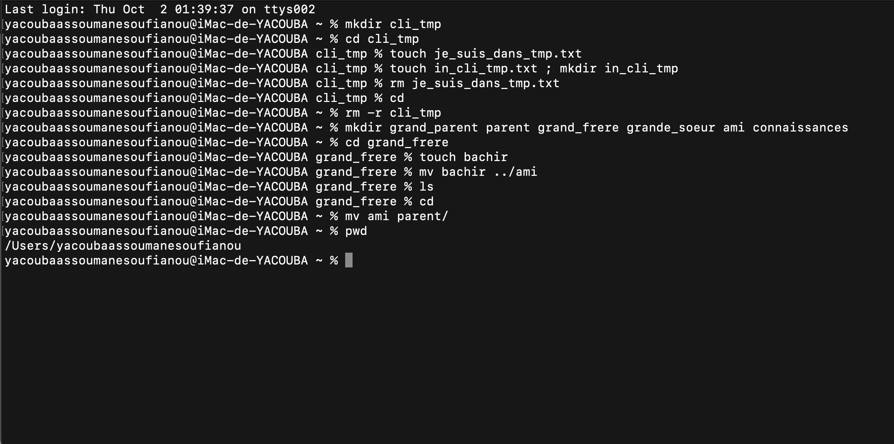

- mkdir cli_tmp : cette commande permet de creer un dossier nommé cli_tmp.
- cd cli_tmp : permet de deplacer vers  le sous dossier cli-tmp.
- touch je_suis_dans_tmp.txt : touch permet de creer un fichier nommé je_suis_dans_tmp.txt.
- rm je_suis_dans_tmp.txt : rm permet de supprimer le fichier.
- cd : se deplacer vers le repertoir personnel.
- rm -r cli_tmp : rm -r permet de supprimmer le dossier cli_tmp et tout son contenu.
- mkdir grand_parent parent grand_frere grande_soeur ami connaissances : ceer plusieurs dossier a la foie.
- cd grand_frere : deplacer vers le dossier grand_frere.
- touch bachir : creer un fichier bachir avec touch dans le dossier grand_frere.
- mv bachir ../ami : mv permet de deplacer le fichier bachir dans un sous dossier ami.
- ls : la commande ls permt de lister tout les elements du repertoire.
- cd : se deplacer vers le repertoire personnel.
- mv ami parent/ : deplacer le dossier ami vers le dossier parent.
- pwd : cette commande permet de voir le chemin de votre répertoire courant.