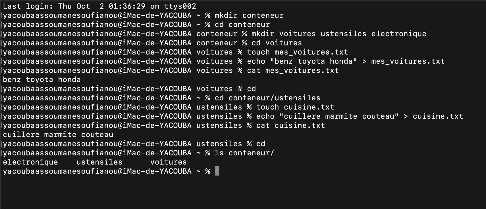

- mkdir conteneur : j ai creer un dossier conteneur avec la commande mkdir.
- cd conteneur : se deplacer vers le dossier conteneur avec cd conteneur.
- mkdir voitures ustensiles electronique : j ai creer 3 dossiers dans le conteneur avec mkdir.
- cd voitures : se deplacer vers le dossier voitures.
- touch mes_voitures.txt : dans voitures j ai creer un fichier mes_voitures.txt avec touch.
- echo "benz toyota honda" > mes_voitures.txt : echo fait afficher sans le voir "benz toyota honda" dans le fichier creer.
- cat mes_voitures.txt : cat fait afficher le contenu dans le fichier.
- cd : deplacer vers le repertoire personnel.
- cd conteneur/ustensiles : marcher vers le sous dossier qui se trouvent dans conteneur.
- touch cuisine.txt : creer un fichier cuisine.txt avec touch.
- echo "cuillere marmite couteau" > cuisine.txt : echo fait afficher sans le voir "cuillere marmite couteau" dans le fichier creer.
- cat cuisine.txt : cat affiche les elements qui est dans le fichier cuisine.txt.
- cd : deplacer vers le repertoire personnel.
- ls conteneur/ : ls va lister tout les elements qui sont dans le dossier conteneur.