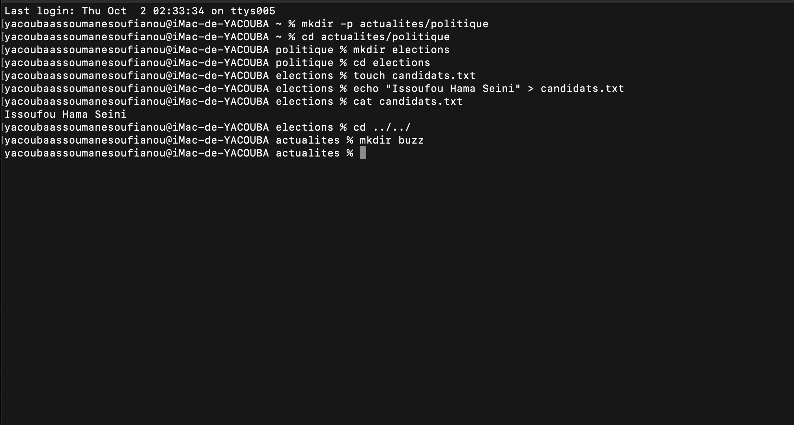

- mkdir -p actualites/politique : mkdir avec l'option -p permet de creer 2 dossiers l'un dans l'autre actualites/politique d'ou l’arborescence .
- cd actualites/politique : deplacer en suivant le chemin donner .
- mkdir elections : creer un nouveau dossier dans le sous dossier politique.
- cd elections : deplacer vers le nouveau dossier ceer elections.
- touch candidats.txt : j ai creer un fichier candidats.txt dans election avec touch.
- echo "Issoufou Hama Seini" > candidats.txt : echo permet d'afficher "Issoufou Hama Seini" dans le fichier.
- cat candidats.txt : permet de voir le contenu du fichier.
- cd ../../ : Remontez deux niveaux pour revenir dans le dossier actualites.
-  mkdir buzz : creer un dossier buzz dans le dossier actualites.