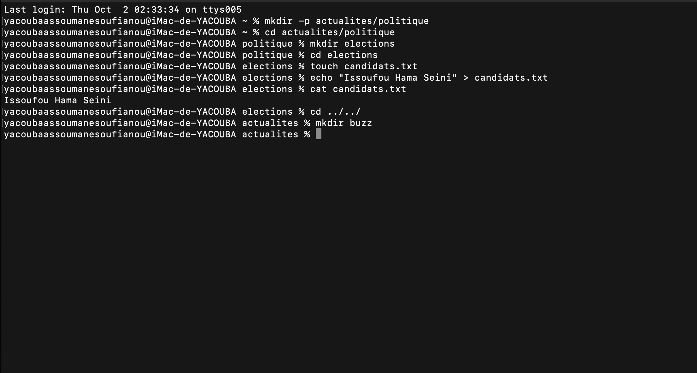

 

- touch .configuration : j ai creer un fichier cache nommé .configuration avec touch
- ls -a : ca permet de lister tout les elemens vusible ou cache dans le repertoire courant.
- mkdir -p creations/crayons : creer des dossiers l'un dans l'autre .
- cd creations/crayons : deplacer vers le sous dossier crayons.
- touch couleurs.txt : dans crayons j ai creer un fichier couleurs.txt avec touch.
- ls : lister tout les elements dans le dossier crayons.
- mv couleurs.txt colors.txt : la commande mv permet de modifier le fichier couleurs.txt par le nouveau fichier colos.txt
- ls : pour lister les elements du contenu .
- cd ../ : pour remonter dans le dossiers parent .
- touch gomme.txt : creer un fichier .
- mv gomme.txt crayons : deplacer le fichier dans le dossier .
- cd : deplacer vers le repertoire personnel .