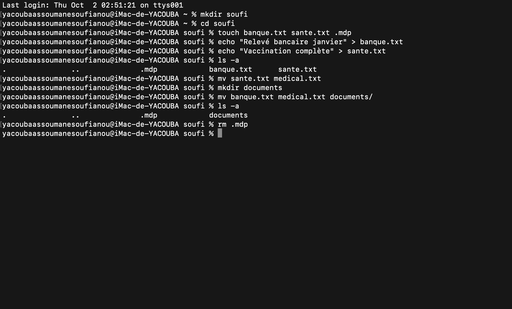

- mkdir soufi : jai creer un dossier soufi.
- cd soufi : se dplacer dans soufi .
- touch banque.txt sante.txt .mdp : jai creer 3 fichiers avec la commande touch.
- echo "Relevé bancaire janvier" > banque.txt : echo permet d'afficher "Relevé bancaire janvier" dans le fichier banque.txt qui est deja creer.
- echo "Vaccination complète" > sante.txt : echo permet d'afficher "Vaccination complète" dans le fichie sante.txt qui est deja creer.
- ls -a : ls permet de lister tout les elements du dossier courant avec l'option -a va listé meme les fichiers caché.
- mv sante.txt medical.txt : modifier le fichier sante.txt par le fichier medical.txt avec mv.
- mkdir documents : nouveau dossier creer dans soufi avec mkdir.
- mv banque.txt medical.txt documents/ : deplacer les 2 fichiers dans le dossier documents qui sont dans le repertoire courant avec mv.
- ls -a : ls -a permet de lister tout les elements du dossier courant avec les fichiers caché.
- rm .mdp : jai supprimmez le fichier caché avec rm. 
